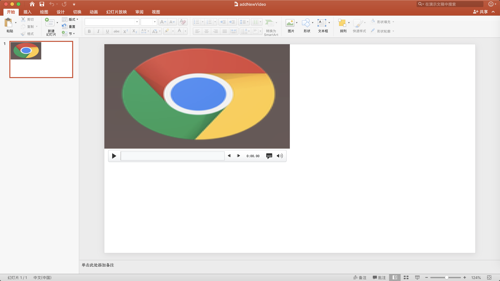

# PPTFactory
## 简介
     创建或修改PPT文件
## 例子
1. 添加文字
```js
        static void TestAddNewText()
        {
            using (AnalysisCore analysisCore = AnalysisCore.New(AppDomain.CurrentDomain.BaseDirectory + "/addNewText.pptx"))
            {
                var sldpart = analysisCore.Doc.GetSlidePart(0);
                Bounding bounding = new Bounding()
                {
                    X = 192,
                    Y = 108,
                    Width = 384,
                    Height = 108,
                    Rotation = 90
                };
                var transform2D = analysisCore.CreateTransform2D(new Size(1920, 1080), bounding);
                PPTTextStyle textStyle = new PPTTextStyle()
                {
                    Color = "#FF0000",
                    IsUnderline = true,
                    IsBold = true,
                    IsItalic = true
                };
                analysisCore.AddText(sldpart, "第1个场景页", textStyle, transform2D);
            }
        }
```
效果如下：

  

2. 创建PPT页并添加文字
```js
        static void TestAddNewSlide()
        {
            using (AnalysisCore analysisCore = AnalysisCore.New(AppDomain.CurrentDomain.BaseDirectory + "/addNewSlide.pptx"))
            {
                var sldpart = analysisCore.AddNewSlide();
                Bounding bounding = new Bounding()
                {
                    X = 1536,
                    Y = 864,
                    Width = 384,
                    Height = 108,
                    Rotation = 45
                };
                var transform2D = analysisCore.CreateTransform2D(new Size(1920, 1080), bounding);
                PPTTextStyle textStyle = new PPTTextStyle();
                analysisCore.AddText(sldpart, "第二个场景页", textStyle, transform2D);
            }
        }
```  
效果如下：
  

3. 添加图片
```js
        static void TestAddPicture()
        {
            using (var analysisCore = AnalysisCore.New(AppDomain.CurrentDomain.BaseDirectory + "/addNewPicture.pptx"))
            {
                Bounding bounding = new Bounding()
                {
                    X = 960,
                    Y = 540,
                    Width = 384,
                    Height = 384,
                    Rotation = 45
                };
                var transform2D = analysisCore.CreateTransform2D(new Size(1920, 1080), bounding);
                analysisCore.AddPicture(0, AppDomain.CurrentDomain.BaseDirectory + "Image/test.png", transform2D);
            }
        }
```
效果如下：


4. 添加视频
```js
        static void TestAddNewVideo()
        {
            using (var analysisCore = AnalysisCore.New(AppDomain.CurrentDomain.BaseDirectory + "/addNewVideo.pptx"))
            {
                var sldpart = analysisCore.Doc.GetSlidePart(0);
                Bounding bounding = new Bounding()
                {
                    Width = 960,
                    Height = 540,
                };
                var transform2D = analysisCore.CreateTransform2D(new Size(1920, 1080), bounding);
                analysisCore.AddVideo(
                    sldpart,
                    AppDomain.CurrentDomain.BaseDirectory + "/gdp.mp4",
                    AppDomain.CurrentDomain.BaseDirectory + "/test.png",
                    transform2D);
                analysisCore.Doc.Save();
                //dispose时写入文档,建议使用using否则容易忘记
                //analysisCore.Doc.Dispose();
            }
        }
```
效果如下：
