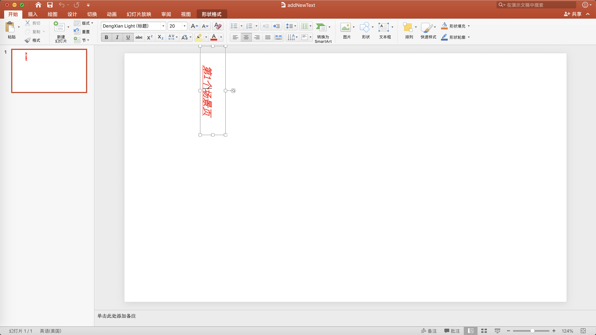
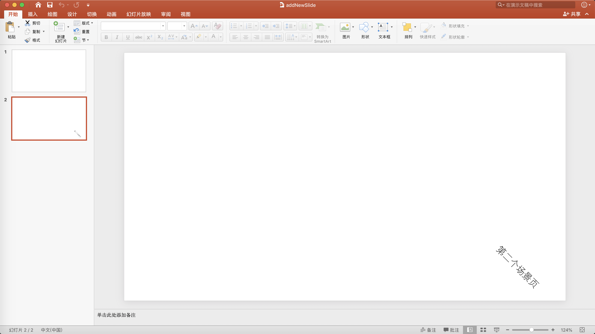
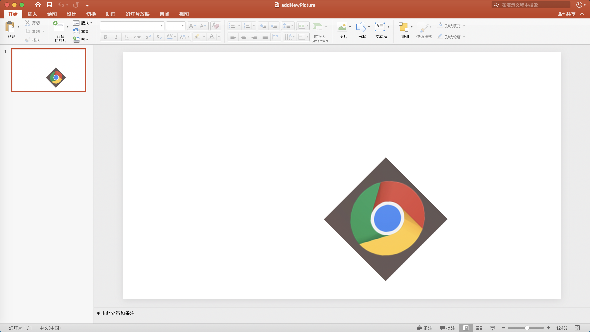

# PPTFactory
## 简介
     创建或修改PPT文件
## 例子
1. 添加文字
```js
        static void TestAddNewText()
        {
            AnalysisCore analysisCore = new AnalysisCore();           
            var sldpart = analysisCore.Doc.GetSlidePart(0);
            var transform2D = new D.Transform2D()
            {
                Offset = new Drawing.Offset() { X = (Int64)(analysisCore.Width * 0.1), Y = (Int64)(analysisCore.Height * 0.1) },
                Extents = new Drawing.Extents() { Cx = (Int64)(analysisCore.Width * 0.2), Cy = (Int64)(analysisCore.Height * 0.1) },
                Rotation = 90 * 60000,
            };
            PPTTextStyle textStyle = new PPTTextStyle()
            {
                Color = "#FF0000",
                IsUnderline = true,
                IsBold = true,
                IsItalic = true
            };
            analysisCore.AddText(sldpart, "第1个场景页", textStyle, transform2D);
            analysisCore.Doc.SaveAs(AppDomain.CurrentDomain.BaseDirectory + "/addNewText.pptx");
        }
```
效果如下：

  

2. 创建PPT页并添加文字
```js
        static void TestAddNewSlide()
        {
            AnalysisCore analysisCore = new AnalysisCore();
            var sldpart = analysisCore.AddNewSlide();
            var transform2D = new D.Transform2D()
            {
                Offset = new Drawing.Offset() { X = (Int64)(analysisCore.Width * 0.8), Y = (Int64)(analysisCore.Height * 0.8) },
                Extents = new Drawing.Extents() { Cx = (Int64)(analysisCore.Width * 0.2), Cy = (Int64)(analysisCore.Height * 0.1) },
                Rotation = 45 * 60000,
            };
            PPTTextStyle textStyle = new PPTTextStyle();
            analysisCore.AddText(sldpart, "第二个场景页", textStyle, transform2D);
            analysisCore.Doc.SaveAs(AppDomain.CurrentDomain.BaseDirectory + "/addNewSlide.pptx");
        }
```  
效果如下：
  

2. 添加图片
```js
        static void TestAddPicture()
        {
            var analysisCore = new AnalysisCore();
            var transform2D = new D.Transform2D()
            {
                Offset = new Drawing.Offset() { X = (Int64)(analysisCore.Width * 0.5), Y = (Int64)(analysisCore.Height * 0.5) },
                Extents = new Drawing.Extents() { Cx = (Int64)(analysisCore.Width * 0.2), Cy = (Int64)(analysisCore.Width * 0.2) },
                Rotation = 45 * 60000,
            };
            analysisCore.AddPicture(0, AppDomain.CurrentDomain.BaseDirectory + "Image/test.png", transform2D);

            var path = AppDomain.CurrentDomain.BaseDirectory + "/addNewPicture.pptx";
            var ret = analysisCore.Doc.SaveAs(path);

            ret.Close();
            ret.Dispose();

            analysisCore.Dispose();
        }
```
效果如下：
